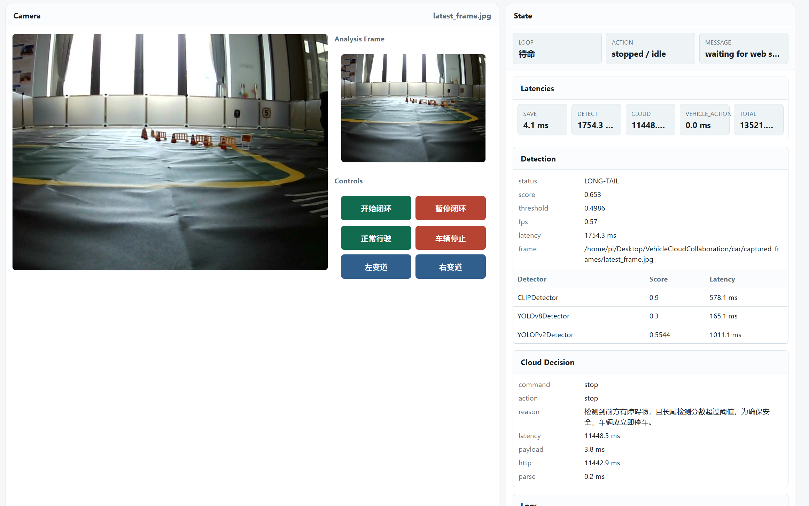

# VehicleCloudCollaboration

这是一个车云协同实验仓库，车端闭环由摄像头、长尾检测、云端 LLM 决策、车辆控制和网页控制台组成。


## 目录结构

```text
VehicleCloudCollaboration/
└── car/
    ├── run_closed_loop.py
    ├── cloud_client/
    ├── longtail/
    └── control/
```

## 车端闭环

中期演示入口：

```bash
cd /home/pi/Desktop/VehicleCloudCollaboration/car
python run_closed_loop.py
```

默认流程：

1. `CameraStream` 读取本地摄像头画面。
2. `vehicle_control` 网页控制台展示摄像头画面、车辆状态和闭环开始按钮。
3. 点击网页里的“开始闭环”后，车辆才会进入自动行驶。
4. `LongTailClassifier` 输出长尾分数。
5. 分数达到阈值时调用 `cloud_client` 的 OpenAI-compatible `/v1/chat/completions` 接口。
6. 云端 LLM 只在 `left` 和 `right` 中返回一个变道决策。
7. 车端将 `left`/`right` 映射为 `lane-left`/`lane-right` 并通过 `VehicleController` 执行。

常用参数：

```bash
python run_closed_loop.py
CAR_LONGTAIL_THRESHOLD=0.6 python run_closed_loop.py
python run_closed_loop.py --cloud-mode none
python run_closed_loop.py --cloud-url https://your-ngrok-or-cloud-base-url
python run_closed_loop.py --web-port 8081
python run_closed_loop.py --no-web
python run_closed_loop.py --start-immediately
python run_closed_loop.py --no-stop-for-detection
```

当前默认变道参数参考见 `car/control/vehicle_control/lane_change_reference.yaml`。

## 演示视频

<video src="readme.assets/video.mp4" controls width="100%"></video>

[查看演示视频](readme.assets/video.mp4)

## 网页控制台

网页控制台默认地址：

```text
http://<车辆IP>:8080
```

网页控制台会实时展示摄像头流、最新分析帧、闭环日志、检测器分数、阶段时延和云端决策。



## 车端模块

### car/longtail

长尾检测模块，核心类是 `LongTailClassifier`。检测器配置由 `.env` 环境变量文件生成，示例见根目录 `.env_example`。它组合多个检测器，对单张图片输出：

- `is_long_tail`
- `score`
- `threshold`
- `individual_scores`
- `inference_time`
- `fps`

模块说明见 [car/longtail/README.md](car/longtail/README.md)。

### car/cloud_client

车端云服务客户端模块。`CloudClient` 调用云端 OpenAI-compatible `/v1/chat/completions` 服务，发送文本检测信息和当前图片，解析车辆动作决策。

模块说明见 [car/cloud_client/README.md](car/cloud_client/README.md)。

### car/control

车辆控制模块，包含底层底盘封装、动作控制、摄像头流和网页控制服务。

支持动作：

- `forward`
- `stop`
- `lane-left`
- `lane-right`

模块说明见 [car/control/README.md](car/control/README.md)。

## 云端配置

云端服务地址通过根目录 `.env` 配置：

```text
CAR_CLOUD_API_BASE_URL="https://your-ngrok-or-cloud-base-url"
CAR_CLOUD_MODEL="qwen3.5:9b"
```

`.env_example` 只保留占位配置，避免把个人公网 API 地址提交到代码里。

## 运行检查

安装依赖：

```bash
conda activate car
pip install -r requirements.txt
```

只检查入口参数和语法，不启动电机：

```bash
cd /home/pi/Desktop/VehicleCloudCollaboration
python -m py_compile car/run_closed_loop.py car/cloud_client/mock_client.py
python car/run_closed_loop.py --help
```

## 闭环数据测试

不启动车辆硬件的完整数据闭环测试：

```bash
cd /home/pi/Desktop/VehicleCloudCollaboration
python car/test/closed_loop_test.py
```

测试说明见 [car/test/README.md](car/test/README.md)。

## 许可证

本项目仅供研究使用。
