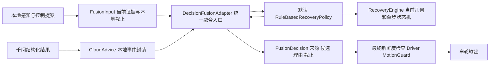

# 统一本地与云端的决策融合接口

2026-10-10；用户明确要求补齐统一融合模块，“jev”具体替换对象由用户决定后续再说。本次是已批准恢复链路的接口提取与输出检查，直接在当前聊天实施；不扩展到新的模型研究或整仓重构。

现状核查：原 `RecoveryEngine` 已有规则仲裁；`RecoveryCoordinator` 同时处理网络队列和调用该规则，`onboard` 另外选择执行截止。不是没有融合判断，而是缺少独立命名、稳定输入输出和可替换策略接口。

## 当前实现结构

`adapter`负责统一接口与输出校验；`policy`负责融合判断。当前采用规则策略，**不是神经网络特征融合，也不是本地/云端PWM加权平均**。云建议选候选，局部几何与控制器决定受限动作。

## 输入和输出

- `FusionInput`：当周期本地 `DifferentialDriveCommand`、绑定的当前图像/掩码/候选/IMU/硬条件证据、单调时钟、本地控制器截止、网络忙标记。
- `CloudAdvice`：本地生成的event ID、经过严格合同验证的语义对象、接收时钟、错误类型。provider不定义本地执行身份。
- `FusionDecision`：command、source（local/cloud_recovery/hold）、reason、deadline、event_id、candidate_id、sequence、policy_id。停车强制规范成零指令且无执行截止。

稳定接口 `FusionPolicy` 要求 evaluate/receive/veto/get_state/drain_transitions 与 pending_request。get_state至少提供phase和event_id；请求沿用恢复任务的context/frames/started合同，以便现有worker保存并发送。默认 `RuleBasedRecoveryPolicy` 包装现有RecoveryEngine；`RecoveryCoordinator(..., fusion_policy=...)` 支持显式注入替代实现，无须改provider、onboard或driver。单测同时覆盖独立实现（不继承RecoveryEngine）。尚未提供任意模型字符串的配置加载器。

## 输出检查与替换边界

融合入口检查当前硬条件、帧新鲜度/序号和时钟顺序；非有限命令、未知来源、策略异常和无截止运动均停车。本地输出只能保留实际输入提案；云恢复必须绑定已接收的严格合同结果、当前请求event和当前候选，并使用请求之后的新捕获帧。默认策略仍检查场景变化、候选语义、IMU及恢复预算。

融合入口另外锁定每个云事件首次短步的截止，后续策略输出不能滚动续期，同一已消费事件不能再启动一段运动。本地许可不能晚于本地控制器截止；云步时间不超过0.15秒。最终driver继续检查截止，MotionGuard/看门狗/人工取消继续独立生效。当前规则控制器的5°软件上限及几何验证不能因为未来换策略而被省略。

将来可以在接口后接另一个规则、学习策略或模型适配器，但需要它输出同一合同、保持当前几何/IMU/预算等约束，并通过回放和实车准入测试。接口存在不等于某个未指定模型可直接热插拔；用户已把具体模型选择延期，本次没有实现或声称实现“jev”/JEPA。

## 日志和验证

`cloud/decisions.jsonl`、`applications.jsonl`和网页已有cloud状态内新增fusion对象，能追踪来源、候选、帧和截止。最终driver拒绝时融合状态也收到veto，不能仍显示运动许可。

验证覆盖本地提案、云恢复同格式输出、无截止/过期/硬条件否决、策略异常/伪造命令、策略替换和禁止续期；已有onboard完整无硬件测试改为断言fusion来源与默认policy ID。无须重跑付费API：模型和传输合同未变，上一版2次API保留原时间/版本标签，不能作为本轮新调用。
